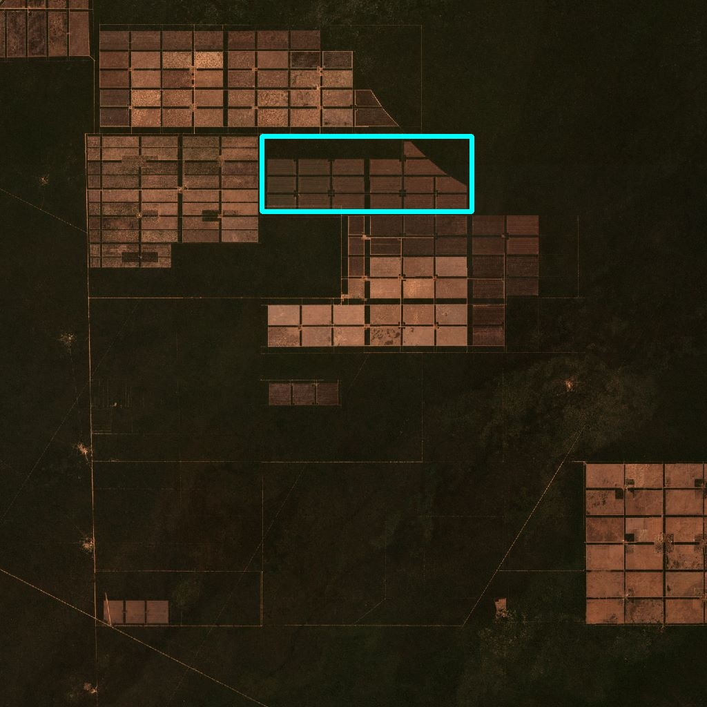

<p align="center">
 
<em> Generated from NASA's 
<a href=https://landsat.gsfc.nasa.gov/apps/YourNameInLandsat-main">Your Name in Landsat.</a> </em>
</p>

<p align="center">
  <a href="https://www.arxiv.org/abs/2503.00348">
    
  </a>
</p>

# Summary
SHAZAM is a self-supervised change monitoring method demonstrated for hazard detection and mapping 
in a region of interest (ROI), using multispectral satellite images. SHAZAM is generalisable across 
different geographical locations, and is able to detect and map a diverse range of hazards without 
any labelled samples. Some examples of SHAZAM outputs are shown below:

<p align="center">
 
 
 
 
 
 
</p>

<p align="center">
 
 
 
 
 
 
 <em> Different hazards captured by the Sentinel-2 satellite (top row) and their corresponding heatmaps
made by SHAZAM when monitoring each ROI (bottom row). The hazards are: wildfires, out-of-season snowfall,
floods, drought, algal blooms, and deforestation, from left to right. </em>
</p>

# Library Structure
- shazam/ contains the model architecture (PyTorch Lightning), dataloading and all the helpers.
- preprocessing/ contains a group of sequential scripts that convert the train/test
images into train/val/test patches.
- 0_config.py contains all the configuration variables, data dirs, etc.
- 1_train.py trains the model to reconstruct 32x32 patches for a given time of year.
- 2_validate.py re-runs the model on the full-sized training images to output the real image,
reconstructed image, and anomaly heatmaps.
- 3_test.py does the same as 2_validate.py, but on the test dataset.
- 4_results.py generates the plots and results tables seen in the paper.


# Quickstart (TBC)

# Architecture

The SHAZAM method and underlying architecture are shown in the images below -
much more detail is provided in the paper.

<p align="center">
 
 <em> SHAZAM - An overview of the proposed method. The top left visualises the training stage, 
the bottom the inference stage for monitoring an ROI, and the top right highlights training data requirements. </em>
</p>

<p align="center">
 
 <em> SIU-Net model architecture. </em>
</p>

# Datasets (TBC)
Dataset available on Zenodo soon.

# Cite this Work (arXiV)
```
@misc{garske2025shazam,
      title={SHAZAM: Self-Supervised Change Monitoring for Hazard Detection and Mapping}, 
      author={Samuel Garske and Konrad Heidler and Bradley Evans and KC Wong and Xiao Xiang Zhu},
      year={2025},
      eprint={2503.00348},
      archivePrefix={arXiv},
      primaryClass={cs.CV},
      url={https://arxiv.org/abs/2503.00348}}
```


